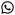

Lawrence Du
=========================

> **Machine Learning** • **Data Science** • **Molecular Biology**

> [larrydu88@gmail.com](mailto:larrydu88@gmail.com) | 626-808-7096 | [github.com/LarsDu](http://github.com/LarsDu) | [linkedin.com/in/LarsDu](http://linkedin.com/in/LarsDu)

> ##### *825 E. Evelyn Ave. Apt 414, Sunnyvale CA 94086*

Skills
--------------------
#### Techniques
Neural networks (CNNs, GANs, GraphNN), decision trees, *k*-fold cross-validation, SVMs, PCA, Louvain/Leiden, *k*-means clustering

#### Tools
Tensorflow, Linux, Pandas, NumPy, Sklearn, Matplotlib, Flask, Amazon EC2, Conda, LaTeX, Jenkins

#### Programming
Python, C\#, SQL, Java, Dart, Bash, MATLAB/Octave, HTML/CSS, C/C++, Perl

#### Languages
Mandarin Chinese and some Spanish

Experience
--------------------

### *Software Engineer II - Machine Learning Engineering • [23andMe](https://www.linkedin.com/company/23andme/mycompany/)*
##### Apr 2020 - Present (Sunnyvale, CA)

 * Major contributor to a new AWS Athena backed service used by researchers for pulling imputed single nucleotide polymorphism metadata used by machine learning models and GWAS pipelines.
 * Created automated model validation pipelines for supporting new deployments of country-matching algorithm *see below* (using Jenkins and MLflow).

### *Data Scientist - Ancestry Product • [23andMe](https://www.linkedin.com/company/23andme/mycompany/)*
##### Nov 2018 - Apr 2020 (Sunnyvale, CA)

 * Developed (and now maintain) current version of machine-learning based country matching algorithm  which reaches >10 million customers worldwide.
 * Adapted new Recent Ancestor Locations to run as a microservice on AWS backed hardware using MLflow for model artifact tracking.
 * Improved graph-based techniques for unsupervised identification of populations by genetic relationships.

### *Bioinformatician IV • [Scripps Research](https://www.scripps.edu/science-and-medicine/cores-and-services/bioinformatics-core/index.html)*
##### May 2018 - Oct 2018 (San Diego, CA)

 * Wrote robust automated sequencing pipelines for Oxford Nanopore data using Common Workflow Language (CWL) for realtime microbial diagnostics, *de novo* genome assembly, and variant calling.

### *Independent Consultant • [Juno Diagnostics/Mindwerks (startup)](https://www.linkedin.com/company/juno-diagnostics/)*
##### Sept 2017 - Feb 2018 (San Diego, CA)

 * Developed novel IP utilizing Tensorflow deep neural networks for identifying genetic abnormalities from sequencing of cell-free DNA.
 * Created a genetic abnormality simulator derived from statistical analysis of human high throughput sequencing data.
 * Authored patent description concerning deep learning applications for diagnosis of genetic conditions.

### *Data Science Fellow • [Insight](https://insightfellows.com/data-science)*
##### Jan 2017 - Apr 2017 (Remote Session - San Diego, CA)

 * Wrote [DeepPixelMonster](https://github.com/LarsDu/DeepPixelMonster) and created an interactive Python Flask web application hosted on Amazon AWS integrated with a Tensorflow back-end for GAN based art generation.

### *PhD Student Biology • UC San Diego • [Scott A. Rifkin Lab](http://labs.biology.ucsd.edu/rifkin/)*
##### Aug 2010 - May 2017 (La Jolla, CA)

 * Performed research on RNA expression noise during animal development by imaging single molecule RNA expression data >5,000 embryos and analyzing data using self-written MATLAB tools for image segmentation, fluorescence quantification, and image deconvolution.
 * Wrote [DeepNuc](https://github.com/LarsDu/DeepNuc) - a CNN model for classifying over 500,000 transcriptional start site (TSS) flanking sequences from humans, mice, fruit flies, and nematodes and over 60,000 microRNA target sequences (from publically available CLEAR-CLIP data).
 * Transgenically modified over 70 nematode and Drosophila strains using techniques such as GIBSON assembly, CRISPR/Cas9, MosSCI, and *PhiC31* integrase.    

Education
---------
**Ph.D Biology**
UC San Diego, 2010 - 2017  

**B.A. Biological Sciences** *Genetics and Development, Magna Cum Laude*
Cornell University, 2006 - 2010  

Activities and interests
------------------------
 
**Hobbies**
:   I enjoy running, painting, and during the pandemic, [I worked on making a VR space shooter simulator.](https://www.youtube.com/watch?v=doYKLAeZUbM&t=37s)

**Extracurricular Activities**
:   23andMe Spitballers Ultimate Frisbee • Machine Learning Society of San Diego • UCSD GSA Lobby Corps • [BioEASI Art and Science Board](https://bioeasi.ucsd.edu/) • Genetics Training Program Grant • Hughes Scholar (2009) • [Cornell Undergraduate Research Board (Vice President)](https://www.cornellcurb.com/) • Triple Helix (writer) • Friends of Farmworkers (tutor)

----

